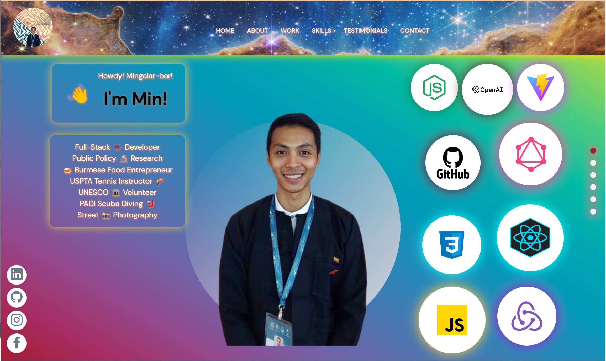
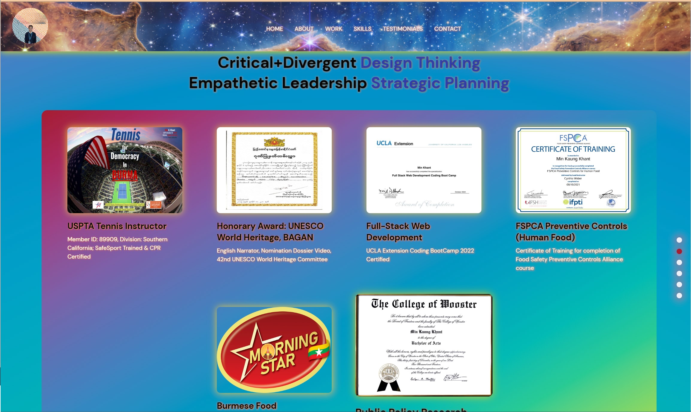
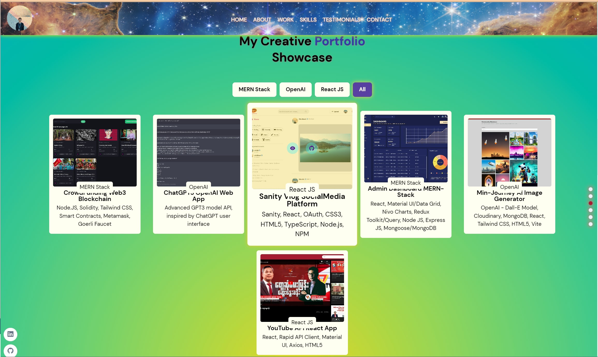
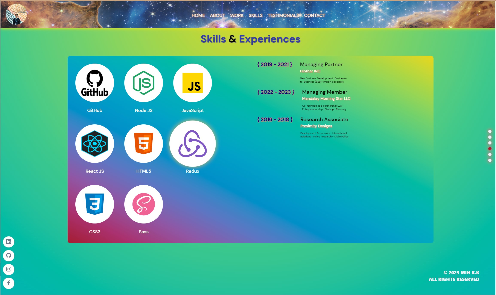
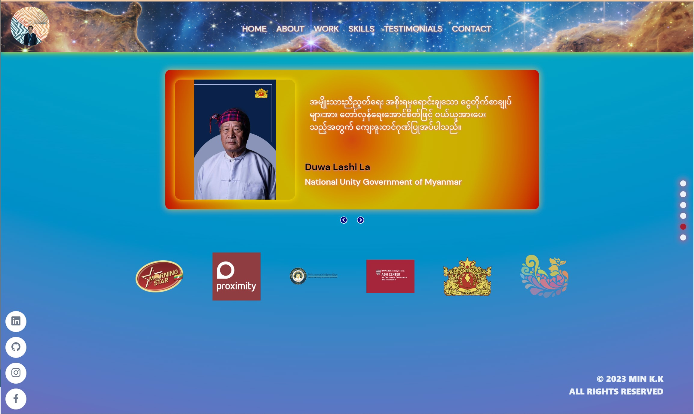
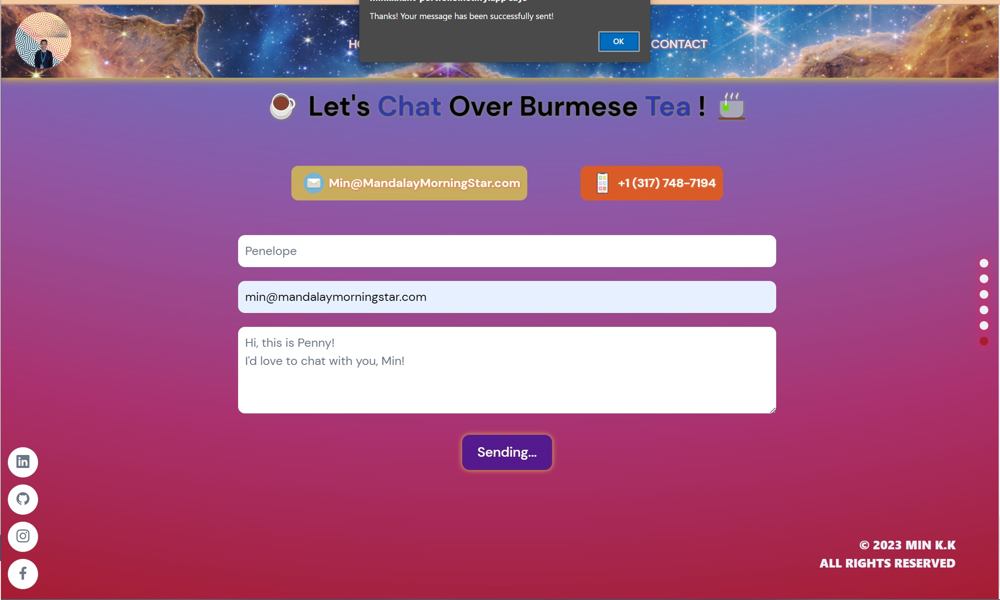
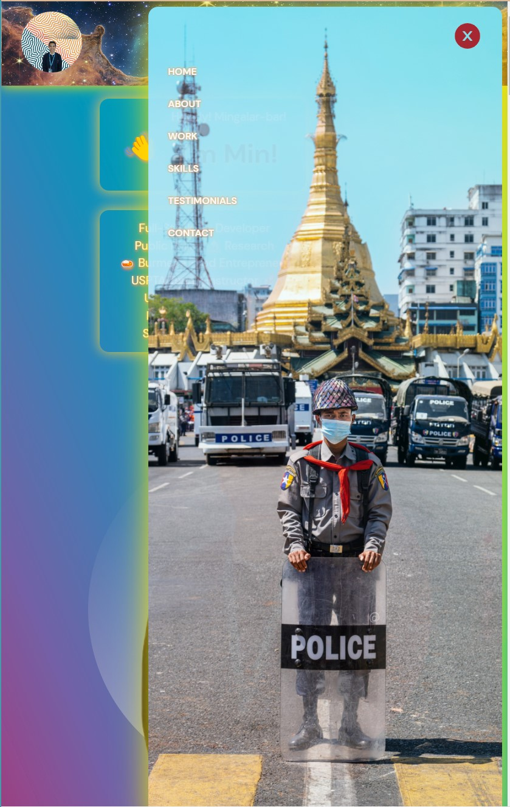

# Project Title: [ Fullstack_Dev_Portfolio ]

Deployed on Netlify Live URL: [ https://minkkhant-portfolio.netlify.app/ ]

## Table of Contents
1. [Description](#description)
2. [Installation](#installation)
3. [Usage](#usage)
4. [Contributing](#contributing)
5. [Tests](#tests)
6. [License](#license)
7. [Questions](#questions)

-----

### Description 
This project is to develop a full-stack web developer's portfolio website with Home, About, Work, Skills, Testimonials, and Contact sections. The website should be modern, mobile responsive, and utilize React as the frontend framework, Sanity as the backend, deployed on Netlify and Email JS for contact management and auto-reply features. This will be a place to share my projects so that I can share my portfolio with fellow developers and collaborate on future projects.

-----

### Installation
React.js,

SCSS,

Node.js,

Email JS,

Sanity Client

### Tech-Stacks
React,

Pleasant Animations,

Framer Motion,

Sanity,

Email JS

-----

### Usage 

Open Source MIT

-----

#### User Story

As a web developer, I want to create a portfolio website that showcases my work, skills, and contact information in a modern and mobile responsive way.

#### Acceptance Criteria:

GIVEN a single-page application portfolio for a web developer WHEN I load the portfolio THEN I am presented with a page containing a header, a section for content, and a footer

WHEN I view the header THEN I am presented with the developer's name and navigation with titles corresponding to different sections of the portfolio

WHEN I view the navigation titles THEN I am presented with the titles About Me, Portfolio, Contact, and Resume, and the title corresponding to the current section is highlighted

WHEN I click on a navigation title THEN I am presented with the corresponding section below the navigation without the page reloading and that title is highlighted

WHEN I load the portfolio the first time THEN the About Me title and section are selected by default

WHEN I am presented with the About Me section THEN I see a recent photo or avatar of the developer and a short bio about them

WHEN I am presented with the Portfolio section THEN I see titled images of six of the developer’s applications with links to both the deployed applications and the corresponding GitHub repository

WHEN I am presented with the Contact section THEN I see a contact form with fields for a name, an email address, and a message

WHEN I move my cursor out of one of the form fields without entering text THEN I receive a notification that this field is required

WHEN I enter text into the email address field THEN I receive a notification if I have entered an invalid email address

WHEN I am presented with the Resume section THEN I see a link to a downloadable resume and a list of the developer’s proficiencies

WHEN I view the footer THEN I am presented with text or icon links to the developer’s GitHub and LinkedIn profiles, and their profile on a third platform (Stack Overflow, Twitter)

-----

### Contributing 
YES 

-----

### Tests 
Jest

-----

### License 
MIT 

-----

Deployed on Netlify Live URL: [ https://minkkhant-portfolio.netlify.app/ ]

### Questions 

#### GitHub Username: min-hinthar 

#### GitHub URL: https://github.com/min-hinthar

#### GitHub Repo: https://github.com/min-hinthar/fullstack_dev_portfolio

#### Email: min@mandalaymorningstar.com

-----
